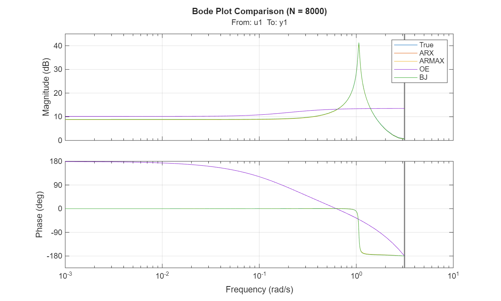
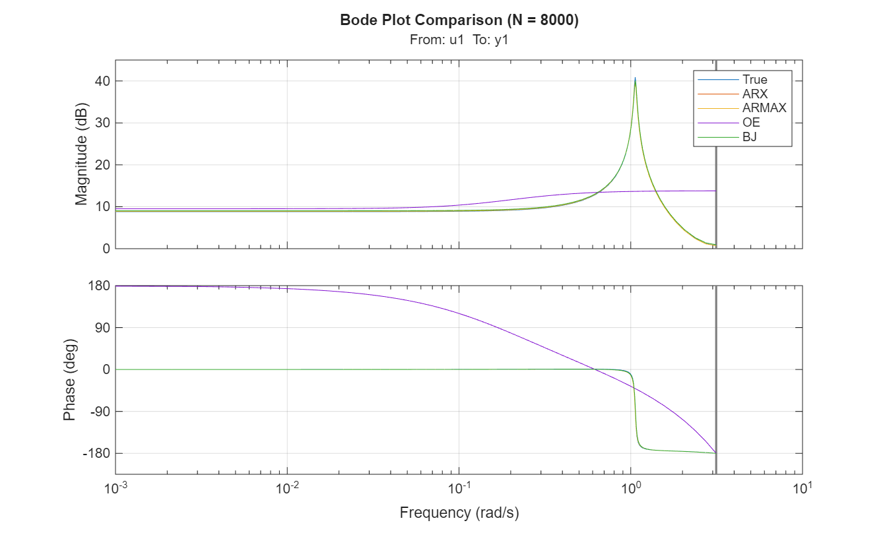
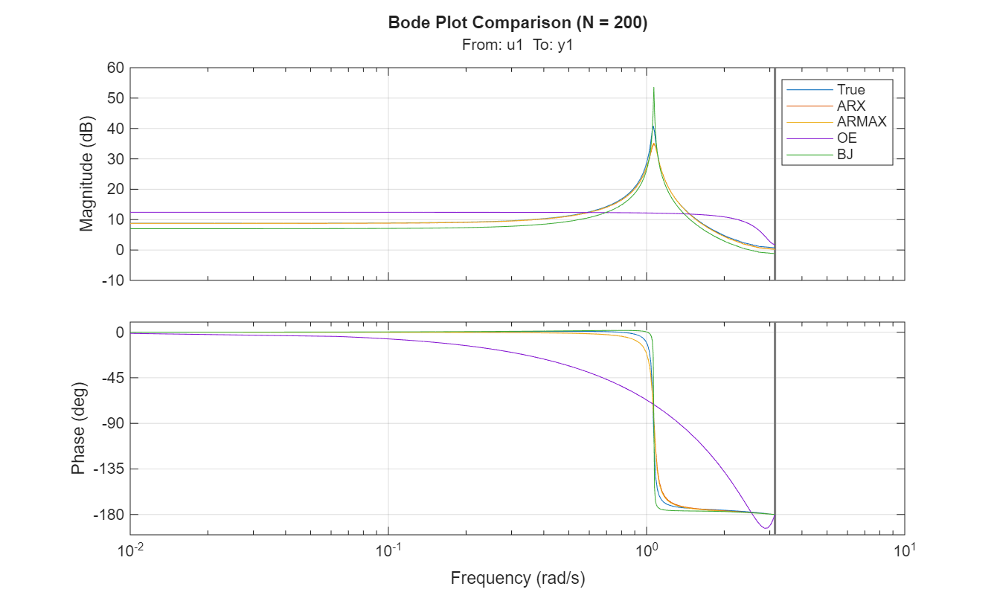
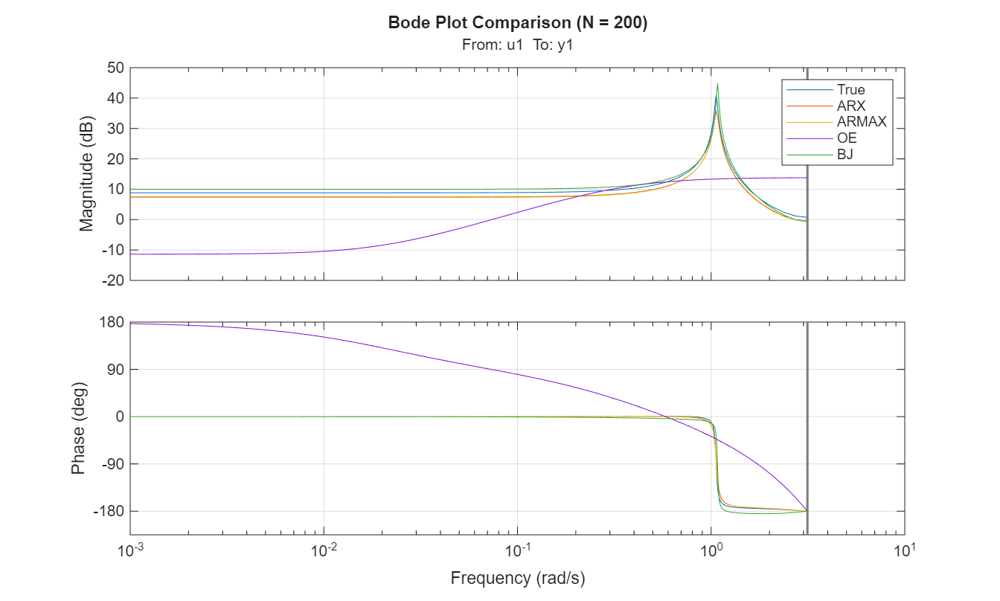
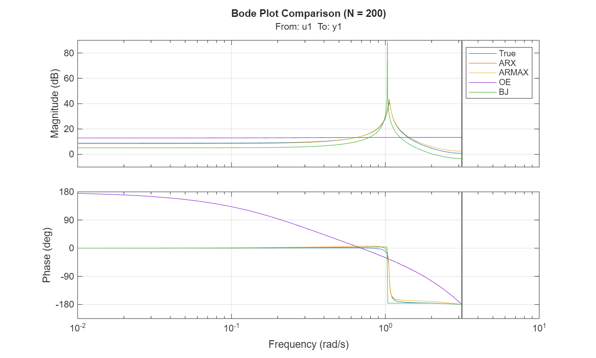

System Identification using Prediction Error Method (PEM)
## Overview
The goal is to estimate a dynamic system from input-output data and compare different parametric model structures in both time and frequency domains.
The analysis includes:
- Data generation from a known discrete-time system
- Model estimation using ARX, ARMAX, OE, and Box-Jenkins structures
- Frequency-domain comparison (Bode plots)
- Statistical validation using asymptotic confidence intervals
## System Description
The true system is defined as:
$y(t) = F_0(z) u(t) + G_0(z) e(t)$
where:
- $u(t)$: deterministic multi-sine input signal
- $e(t)$: white Gaussian noise (WGN)
- $F_0(z), G_0(z)$: true system transfer functions
## Methodology
### 1. Data Generation
A dataset of $N = 8000$ samples is generated using a known discrete-time model.
The input signal is a multi-sine excitation generated using MATLAB `idinput`.
Noise is modeled as white Gaussian noise with variance $σ^2 = 4.6^2$.
### 2. Model Structures
The following parametric models are estimated:(all models are estimated using the MATLAB System Identification Toolbox)
- ARX model
- ARMAX model
- Output Error (OE) model
- Box-Jenkins (BJ) model.
### 3. Frequency Domain Analysis
Bode plots are used to compare the true system with the estimated models.
This allows evaluation of how well each model captures the system dynamics across frequencies.
### 4. Statistical Analysis
For the ARX model:
- parameter estimates are extracted
- asymptotic covariance is computed
- confidence intervals are derived
The consistency of the estimated parameters is verified by checking whether the true parameters lie within the estimated confidence intervals.
## Results
- ARX ARMAX and BJ include the ARX structure and the actual model is ARX so they provide a good approximation of the true system (Note BJ and ARMAX overparametrized the actual model).
- We chose the OE model with $n_f = 1$ but the true denominator has degree of 2 so we have a structural bias.
- Increasing dataset size improves estimation accuracy and reduces variance
- Confidence interval analysis confirms asymptotic correctness of PEM estimates
## Figures
### Frequency Response (Bode Plot)
### Case 1: large dataset ($N=8000)
The following figure shows the comparison between the true system and estimated models:
For $N = 8000$ we see that the Bode plots are nearly identical across all 5 runs. This demonstrates that with a large dataset, the estimator variance is extremely low and the models consistently converge to the true system. the estimation is so stable that we can reliably compare the different model structures. Since the noise influence is minimized, any residual deviation depends solely on the model's ability to capture the system dynamics.
 
 
### Case 2: small dataset ($N=200)
For $N=200$, the Bode plots vary significantly from run to run. This occurs because the small dataset size leads to high estimator variance, making the identification process highly sensitive to the specific realization of noise. The estimation is unreliable because the results are dominated by stochastic noise rather than the system's dynamics.
 
 
 
## Tools Used
- MATLAB
- System Identification Toolbox
